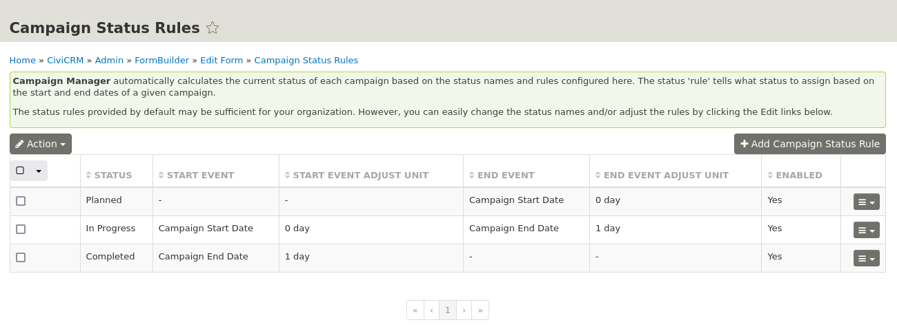

# Campaign Manager (Next Generation)

**Campaign Manager (Next Generation)** is an upgraded version from the original extension [de.systopia.campaign](https://github.com/systopia/de.systopia.campaign).

## Installation

Learn more about installing CiviCRM extensions in the [CiviCRM Sysadmin Guide](https://docs.civicrm.org/sysadmin/en/latest/customize/extensions/).
This extension is not compatible with original extension `de.systopia.campaign`. **It must be uninstalled before installing Campaign Manager**

### Requirements

* PHP v8.0+
* CiviCRM 5.63+
* Extension `de.systopia.campaign` must be disabled before installation.

## Usage

### Campaign Status Rules

Campaign status rules allow you to define an automatic status workflow for Campaigns based on its start and/or end date of the membership.
By default the workflow through campaign statuses is as follows:

- Planned: when *start date* is in the future.
- In Progress: when today is between *start_date* and *end_date*
- Completed: after *end_date*

At `Administer > CiviCampaign > Campaign Status Rules` you will find a summary of the existing status rules.
You can add new statuses and edit existing statuses using this form. To create a new status, you need to specify when the status should start and stop. This is done in relation to a campaign dates (start / end)



#### Keeping Campaign statuses updated

When a campaign is added or edited the status is automatically set based on your status rules. For example, a newly created campaign with *start_date* in the future will be assigned the status "Planned" by default. If your membership statuses are not updating automatically, make sure that the `Update Campaign Statuses` scheduled job is enabled and runs at least once a day. Refer to the Scheduled Jobs chapter for configuration details and consult your system administrator if appropriate.

#### Override Campaign status

In case you don't want to apply status rules to a Campaign, you can **override** its status, checking the field **Status Override?** in the Campaign Form.

### Campaign KPIs

This list of default **Key Performance Indicators** contains the following values of the current campaign (and sub campaigns):

- Contribution Total Amount
- Contribution Count
- Active Members Count


#### Implementing custom KPIs

You can add custom KPIs, developing your custom extension and adding a Class extending abstract class `AbstractKPI` in php namespace `\Civi\CampaignManager\KPI` as:

Define in your extension these files:

`<myExt>/Civi/CampaignManager/KPI/CustomKPI.php`
```php
<?php

namespace Civi\CampaignManager\KPI;

class CustomKPI extends AbstractKPI {

  protected static $name = "custom_kpi";
  protected static $title = "Custom KPI";

  public static function calculate($campaign_id) {
    // Do some calculations
    return $kpiValueToReturn;
  }

}
```

`<myExt>/managed/CustomKPI.mgd.php`
```php
<?php
// phpcs:disable
use Civi\CampaignManager\KPI\ContributionCountKPI as KPI;
// phpcs:enable

return [
  [
    'name' => 'CampaignKPI_custom_kpi',
    'entity' => 'CampaignKPI',
    'cleanup' => 'always',
    'update' => 'unmodified',
    'params' => [
      'version' => 4,
      'values' => [
        'name' => KPI::getName(),
        'title' => KPI::getTitle(),
        'is_active' => TRUE,
      ],
      'match' => [
        'name',
      ],
    ],
  ],
];

```

New custom KPI should be available on after clearing CiviCMR cache.

## Support and Maintenance
This extension is supported and maintained by:

[](https://www.ixiam.com)

Distributed under the terms of the GNU Affero General public license (AGPL).
See [LICENSE.txt](LICENSE.txt) for details.

